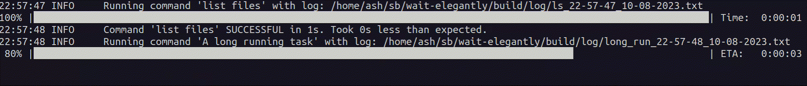

# Wait Elegantly

Do you always run the same long running command that does not report any progress?

Well this script will help run your command while also reporting progress based on previous run times.

You would still be waiting the same amount of time... but more elegantly.

## Usage

    usage: wait_elegantly.py [-h] [-t TRIAGE] [-v] [-g] config

    Wait elegantly while commands executes

    positional arguments:
    config                Path to a config yaml file

    options:
    -h, --help            show this help message and exit
    -t, --triage          Path to a triage error json file
    -v, --verbose         Set the log level to DEBUG
    -g, --granular        Set progress bar to granular

The script takes a yaml config file as input where your commands are defined e.g.

**config.yaml**

    commands:
    - name: "list files"
        id: "ls"
        values:
        - "ls"
        - "-al"
    - name: "Sleep for 5 seconds"
        id: "sleep5s"
        values:
        - "sleep"
        - "5"

## Triage
You can specify an optional triage json file containing error strings you have previously faced.

    {"[ERROR] Ohh an error happened" :  "No worries. Here is a workaround!"}

If the command fails, the script will look for known issues in the log for you.